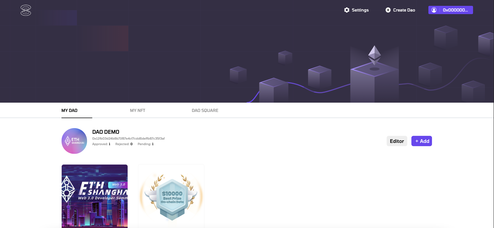

# *Anyone can create a DAO here and join a DAO here*
### SoulBound DAPP DEMO

---

Website[Github Pages]: [https://planckerlabs.github.io/DAOPublicLists/](https://planckerlabs.github.io/DAOPublicLists/)

Website[IPFS]: [ipfs://QmXKvDJTuBBXDHE9vZTvpRDdbVCjfzUXhprnNRUke5QKkE](ipfs://QmXKvDJTuBBXDHE9vZTvpRDdbVCjfzUXhprnNRUke5QKkE/#/)





---

## [`前端/frontend`]
- link:[frontend/](frontend/)

#### [DEMO]
- [demo](https://planckerlabs.github.io/DAOPublicLists/)


#### [开发/DEV]

- Requirements
```shell
Node >= v12
```

```shell
1. npm install
2. npm run build
```

---

## [`后端/backend`]
- link: [contracts/](contracts/)
- contract/合约源码: [contracts/build/](contracts/build/)

   1. [soulBoundBridge.sol](contracts/build/soulBoundBridge.sol) [0x7257fDd92DD8C97CF556c58275d68EE3607c3Dfa](https://mumbai.polygonscan.com/address/0x7257fdd92dd8c97cf556c58275d68ee3607c3dfa#code)
   2. [soulBoundMedal.sol](contracts/build/soulBoundMedal.sol) [0x12fB03d24b8B71F87e4CF7cDD6DefFb87c35F3af](https://mumbai.polygonscan.com/address/0x12fb03d24b8b71f87e4cf7cdd6deffb87c35f3af#code)

#### [开发/DEV]

- Requirements
```shell
Node >= v14 #nvm use v14.19.3
remixd
```

```shell
1. npm install
2. make all
3. remixd -s ./ --remix-ide https://remix.ethereum.org
```

#### [文档/DOC]
[Decentralized Application interface](contracts/DAI.md)

*Note:The current contract is fully composable,any contract can use the current contract as a database or a query tool*


## [`Third-party License`]
*We use some open source software in the project, thanks.*
- link: (Third-party%20License.md)
   - [vue](https://github.com/vuejs/vue)
   - [solc](https://github.com/ethereum/solc-js/)
   - [truffle](https://github.com/trufflesuite/truffle/)
   - [openzeppelin-contracts](https://github.com/OpenZeppelin/openzeppelin-contracts/)
   - [web3.js](https://github.com/ChainSafe/web3.js)
   - [MetaMask/detect-provider](https://github.com/MetaMask/detect-provider)
   - [Tomorrow](https://fonts.google.com/specimen/Tomorrow)


# NFTTool project description
[link](projectDescription.md)
NFTtool project description
1. What problem to solve
The current Dao organization construction, including Dao member registration and Dao activity records, are basically done off-chain and through a centralized mechanism. We try to provide an on-chain and decentralized solution.
Our solution will achieve the following three functions.
1) Decentralized (anyone can deploy) deployment of Dao NFT contracts;
2) Decentralization to form Dao identity certificate
3) Let Dao members get authentication in web3.

2. Main goals and functions

2.1 Decentralized deployment of Dao NFT contracts
We have developed a tool that allows anyone to deploy an ERC721 compliant NFT contract on-chain.
We have added some interfaces on the basis of ERC721 to be more suitable for the operation of Dao.
The owner permission of the contract belongs to the user himself. In subsequent version iterations, we will upgrade the owner permission to a list of whitelisted addresses to build multiple NFT contracts through voting.
The minted NFT-item is non-transferable and achieves the purpose of soul binding.
The main application scenarios of the NFT contract and the mint of NFT-item in the contract are as follows:
1) Anyone can initiate a Dao, and deploying an NFT contract records the initiation of Dao on the chain;
2) The NFT contract manager (owner address) can create a variety of specific NFT-item, different items can represent different meanings, the most common NFT-item are as follows:
(1) Representing a Dao member: someone who mint this NFT-item represents the development of a Dao member;
(2) Representing Dao activities: someone who mints this NFT-item represents participating in this Dao activity, such as participating in this Shanghai Hackathon.
(3) Dao activity NFT-item can also define non-participating identities, such as core contributors and witnesses;
3) Minting NFT-item under the NFT contract requires the approval of the manager (owner address).

2.2 Decentralization to form Dao identity certificate
Because of decentralization, anyone can claim to have built a Dao, and anyone can initiate a fork of Dao. How to prove the legitimacy of Dao?
For example, there are two deployed NFT contracts named Plancker Dao, which contract represents the serious Plancker Dao?
We do it by the way that Dao members give Dao proofs, and technically use the following methods to achieve "proof":
The Dao NFT contract will define a state, which can be simply understood as an integer;
Holding the address of the NFT-item in the Dao NFT contract (that is, a Dao member) can send a special transaction to the NFT contract, which will trigger the integer +1 of the NFT contract.
The larger the integer in the NFT contract, the higher the legitimacy we judge.

2.3 Let Dao members get authentication in web3
The same member will have different contributions in Dao, and he will participate in different activities, so he can also obtain multiple NFT-items of Dao, and each NFT-item represents a different contribution.
The same member may also be a member of multiple Dao, he will get NFT-item of different Dao, each NFT-item points to a Dao's endorsement of the member.
By summarizing the above contributions and endorsements, we can qualitatively display a user identity. As more and more data are accumulated, the more accurate the defined identity.

3 Demonstration of specific cases
Next, we use the NFTtool tool to make a specific demonstration in the Shanghai Hackathon.
background:
1) Plancker Dao deployed an NFT contract through NFTtool;
2) 7 members of Plancker Dao participated in the Shanghai Hackathon;
3) Plancker Dao's NFT contract issued three sets of NFTs, representing:
(1) NFT-item1: Member of Plancker Dao
(2) NFT-item2: The main participants of the Shanghai Hackathon
(3) NFT-item3: Auxiliary Contributor of Shanghai Hackathon
I use screenshots of specific operations on the NFTtool tool to show the entire demonstration process:
Step 1: Create Plancker Dao NFT Contract


Step 2: Add NFT-item1: "Member NFT item" in the Plancker Dao NFT contract management page

Step 3: Members apply to mint Plancker Dao NFT-item

Step 4: Plancker Dao NFT contract administrator (owner address) approves member mint NFT-item

Step 5: Plancker Dao NFT Contract Administrator Generates NFT-item2: Main Participants of Shanghai Hackathon

Step 6: Participating members mint NFT-item2 and admin approve

Step 7: Admin generates NFT-item3, and member mints,
Repeat steps 5 and 6 above.
